<h1>Tobacco Shop</h1>

Repositório destinado a apresentar um aplicativo de e-commerce para a venda de 
    tabaco e cachimbos. O projeto foi desenvolvido com C# e ASP.NET, com padrão de 
    arquitetura MVC. Algumas partes do código foram desabilitadas. A base de dados foi 
    construída em SQL Server.

O site em questão é bem completo. Possui uma Home que apresenta os produtos, 
    a pessoa pode entrar em cada produto e ver especificamente seus detalhes, depois 
    quando seleciona o produto desejado o item é adicionado ao carrinho, que apresenta 
    a lista de todos os itens selecionados. Depois, a pessoa pode fechar o pedido 
    após inserir os dados. Na parte do administrador é possível encontrar diversas 
    abas que vão desde a consulta às tabelas da base dados assim como inserção de novos
     produtos e nesta rota poderá ainda verificar os pedidos feitos, anotando aqueles que não 
     foram realizados pelo site. 

A estrutura da base de dados pode ser vista na figura abaixo

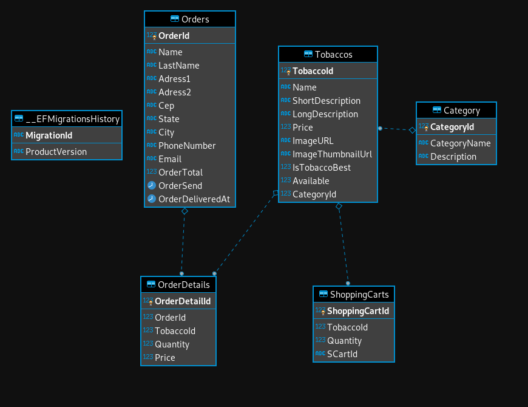

<h3> Algumas instruções primeiro...</h3>

<b>Instalação do dotnet: </b><a href="https://docs.microsoft.com/pt-br/dotnet/core/install/linux-package-manager-ubuntu-2004">https://docs.microsoft.com/pt-br/dotnet/core/install/linux-package-manager-ubuntu-2004</a>

<b>Instalação do CLI dotnet: </b><a href="https://docs.microsoft.com/pt-br/ef/core/miscellaneous/cli/dotnet">https://docs.microsoft.com/pt-br/ef/core/miscellaneous/cli/dotnet</a>

<b>Instalação do SQL Server: </b><a href="https://docs.microsoft.com/pt-br/sql/linux/quickstart-install-connect-ubuntu?view=sql-server-ver15">https://docs.microsoft.com/pt-br/sql/linux/quickstart-install-connect-ubuntu?view=sql-server-ver15</a>

<b>Criando as Migrações: </b><a href="https://docs.microsoft.com/pt-br/ef/core/managing-schemas/migrations/?tabs=dotnet-core-cli">https://docs.microsoft.com/pt-br/ef/core/managing-schemas/migrations/?tabs=dotnet-core-cli</a>

<b>Algumas Referências: </b><a href="https://docs.microsoft.com/pt-br/ef/core/miscellaneous/cli/">https://docs.microsoft.com/pt-br/ef/core/miscellaneous/cli/</a>

<h3>As imagens abaixo mostram o layout do projeto</h3>

OBS: O projeto ainda está em desenvolvimento, e pode apresentar alguns bugs ou erros...

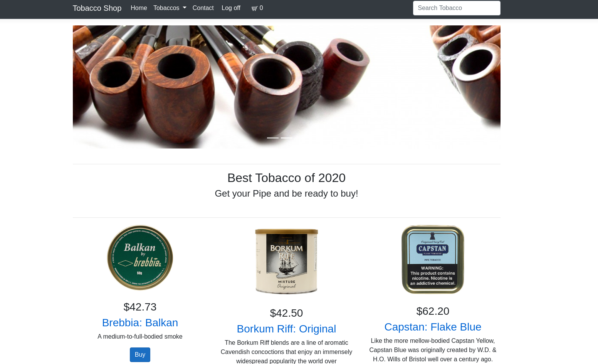
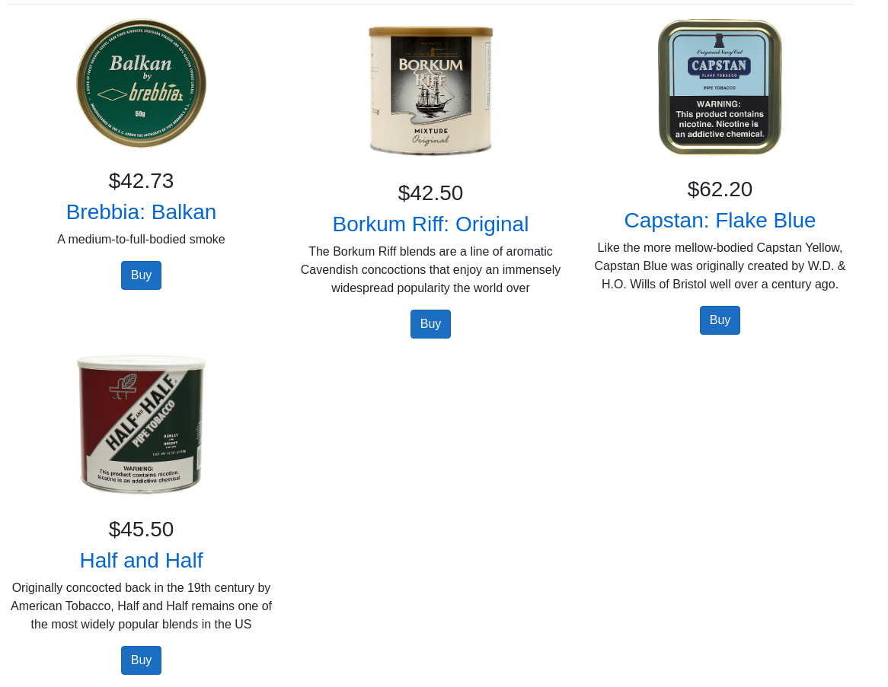
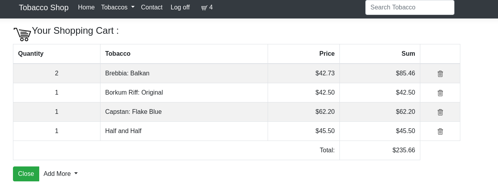

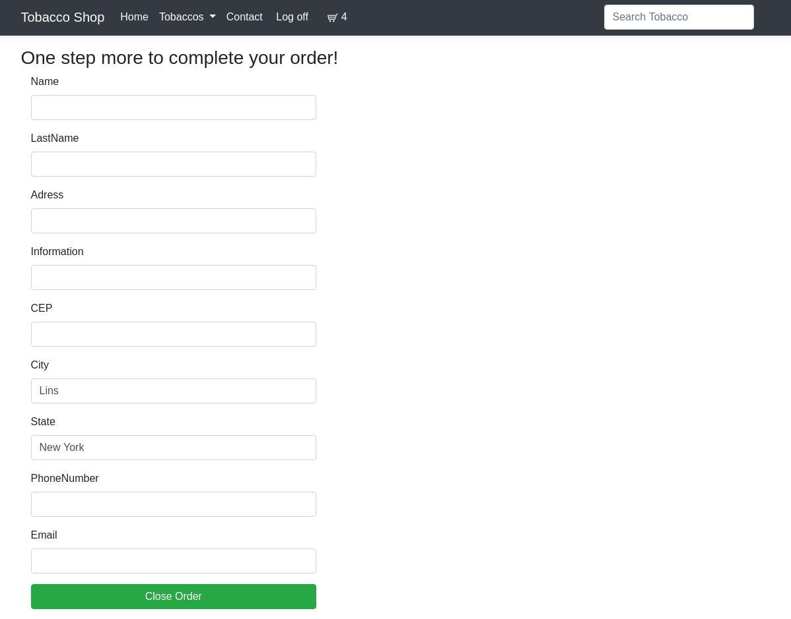
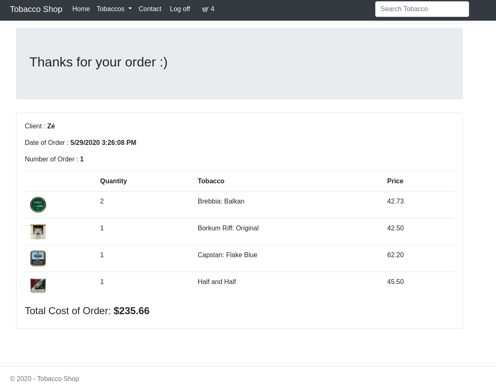
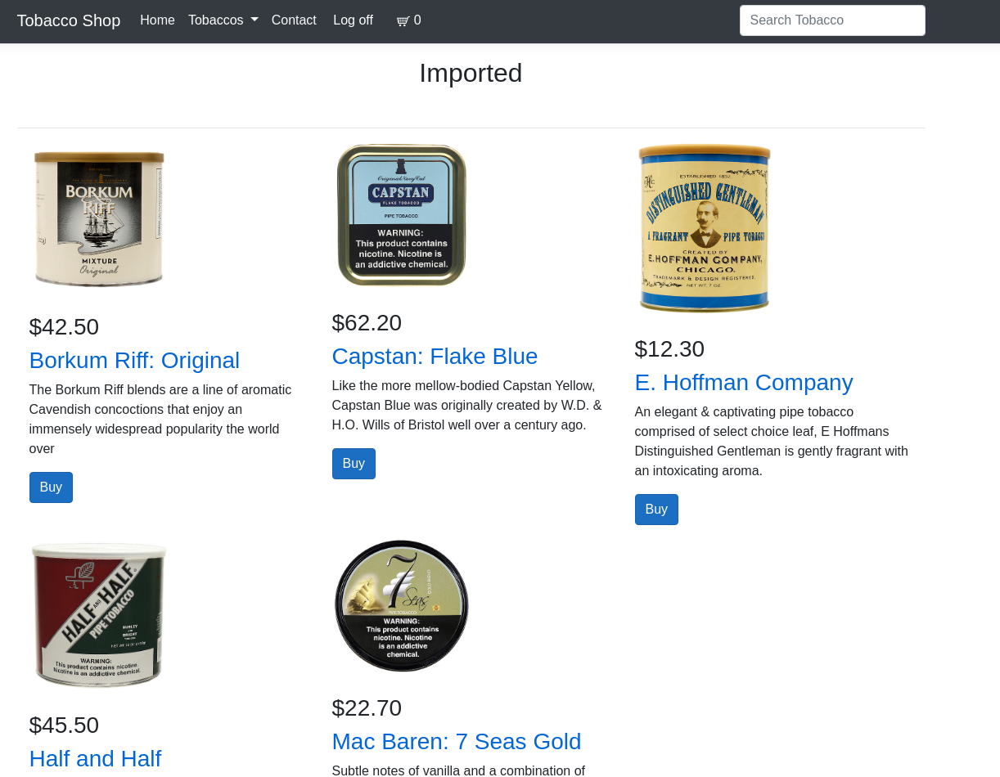
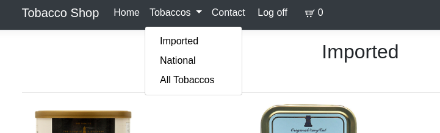
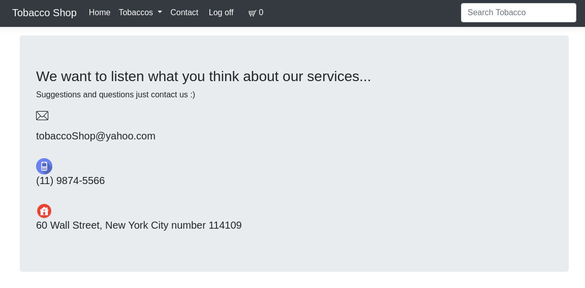
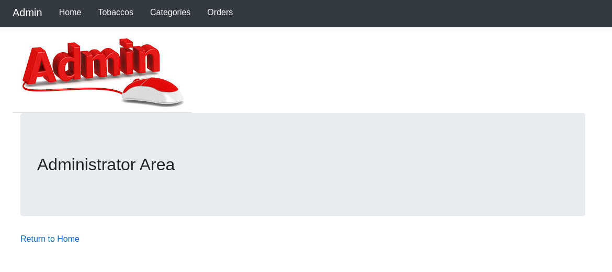
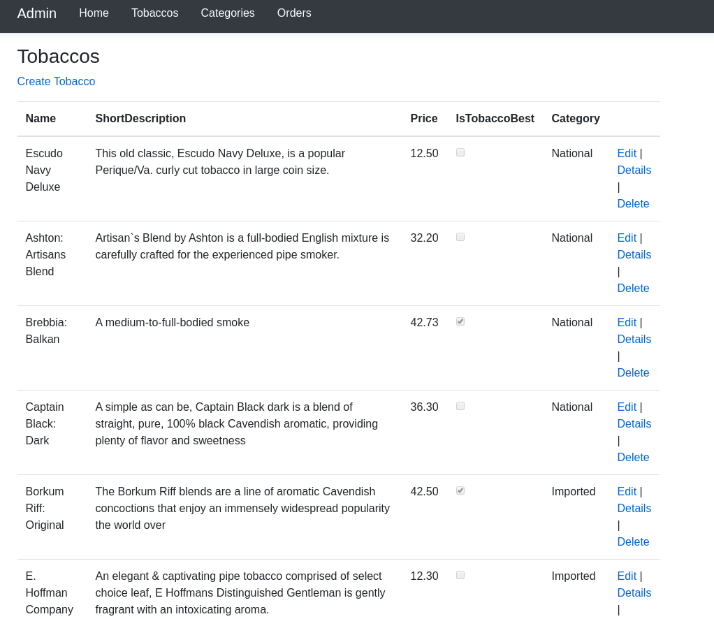
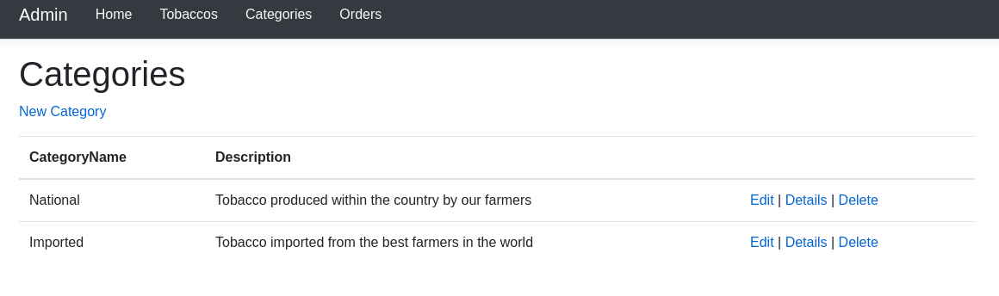
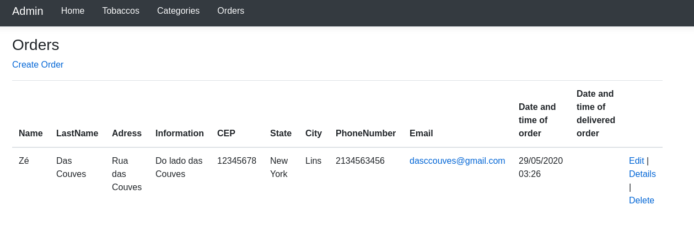
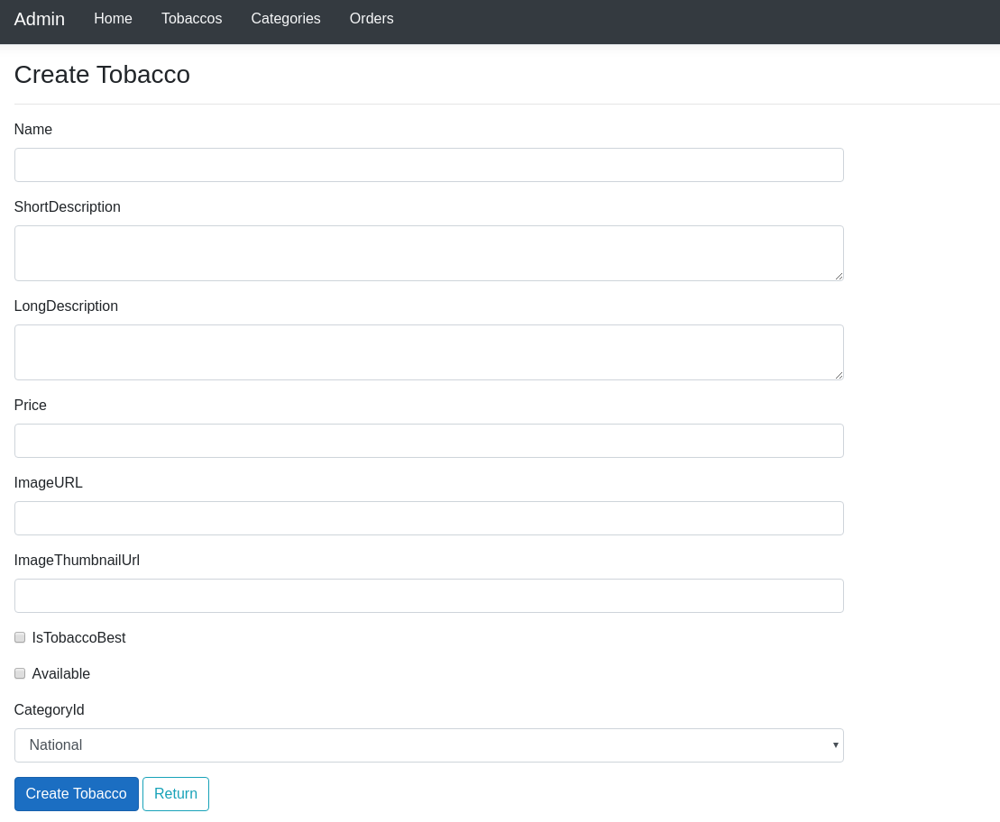
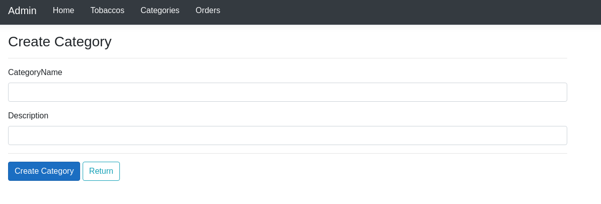
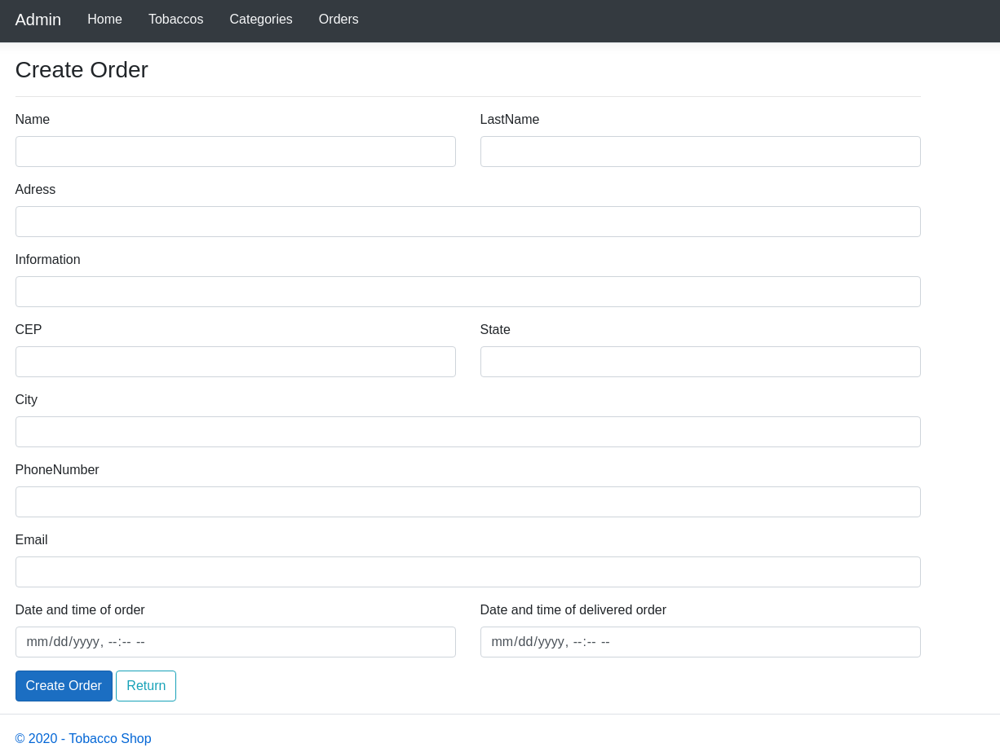
